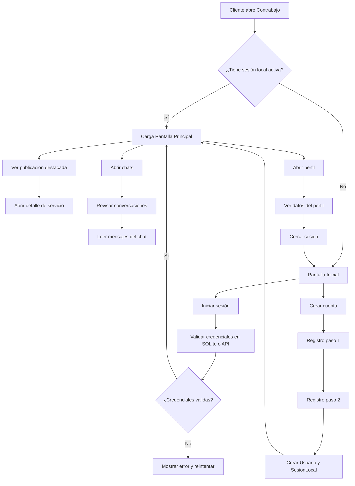

# Vista de Escenarios

```mermaid
flowchart TD
    A["Cliente abre Contrabajo"] --> B{"¿Tiene sesión local activa?"}
    B -- "Sí" --> C["Carga Pantalla Principal"]
    B -- "No" --> D["Pantalla Inicial"]
    D --> E["Iniciar sesión"]
    D --> F["Crear cuenta"]

    E --> G["Validar credenciales en SQLite o API"]
    G --> H{"¿Credenciales válidas?"}
    H -- "Sí" --> C
    H -- "No" --> I["Mostrar error y reintentar"]

    F --> J["Registro paso 1"]
    J --> K["Registro paso 2"]
    K --> L["Crear Usuario y SesionLocal"]
    L --> C

    C --> M["Ver publicación destacada"]
    M --> N["Abrir detalle de servicio"]
    C --> O["Abrir chats"]
    C --> P["Abrir perfil"]

    O --> Q["Revisar conversaciones"]
    Q --> R["Leer mensajes del chat"]

    P --> S["Ver datos del perfil"]
    S --> T["Cerrar sesión"]
    T --> D
```
