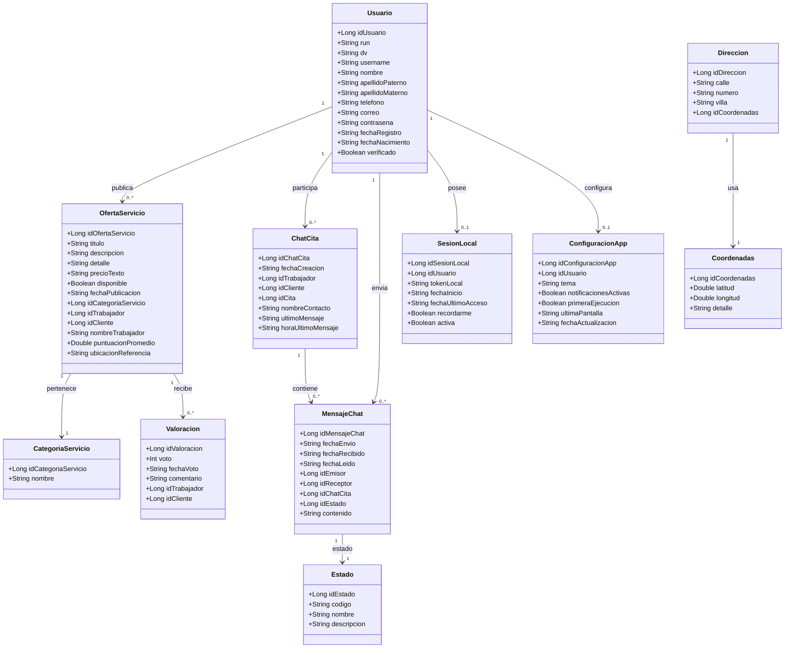

# Vista Lógica

```mermaid
classDiagram
    class Usuario {
        +Long idUsuario
        +String run
        +String dv
        +String username
        +String nombre
        +String apellidoPaterno
        +String apellidoMaterno
        +String telefono
        +String correo
        +String contrasena
        +String fechaRegistro
        +String fechaNacimiento
        +Boolean verificado
    }

    class SesionLocal {
        +Long idSesionLocal
        +Long idUsuario
        +String tokenLocal
        +String fechaInicio
        +String fechaUltimoAcceso
        +Boolean recordarme
        +Boolean activa
    }

    class ConfiguracionApp {
        +Long idConfiguracionApp
        +Long idUsuario
        +String tema
        +Boolean notificacionesActivas
        +Boolean primeraEjecucion
        +String ultimaPantalla
        +String fechaActualizacion
    }

    class OfertaServicio {
        +Long idOfertaServicio
        +String titulo
        +String descripcion
        +String detalle
        +String precioTexto
        +Boolean disponible
        +String fechaPublicacion
        +Long idCategoriaServicio
        +Long idTrabajador
        +Long idCliente
        +String nombreTrabajador
        +Double puntuacionPromedio
        +String ubicacionReferencia
    }

    class ChatCita {
        +Long idChatCita
        +String fechaCreacion
        +Long idTrabajador
        +Long idCliente
        +Long idCita
        +String nombreContacto
        +String ultimoMensaje
        +String horaUltimoMensaje
    }

    class MensajeChat {
        +Long idMensajeChat
        +String fechaEnvio
        +String fechaRecibido
        +String fechaLeido
        +Long idEmisor
        +Long idReceptor
        +Long idChatCita
        +Long idEstado
        +String contenido
    }

    class CategoriaServicio {
        +Long idCategoriaServicio
        +String nombre
    }

    class Estado {
        +Long idEstado
        +String codigo
        +String nombre
        +String descripcion
    }

    class Direccion {
        +Long idDireccion
        +String calle
        +String numero
        +String villa
        +Long idCoordenadas
    }

    class Coordenadas {
        +Long idCoordenadas
        +Double latitud
        +Double longitud
        +String detalle
    }

    class Valoracion {
        +Long idValoracion
        +Int voto
        +String fechaVoto
        +String comentario
        +Long idTrabajador
        +Long idCliente
    }

    Usuario "1" --> "0..*" OfertaServicio : publica
    Usuario "1" --> "0..*" ChatCita : participa
    Usuario "1" --> "0..*" MensajeChat : envia
    Usuario "1" --> "0..1" SesionLocal : posee
    Usuario "1" --> "0..1" ConfiguracionApp : configura
    OfertaServicio "1" --> "1" CategoriaServicio : pertenece
    OfertaServicio "1" --> "0..*" Valoracion : recibe
    ChatCita "1" --> "0..*" MensajeChat : contiene
    Direccion "1" --> "1" Coordenadas : usa
    MensajeChat "1" --> "1" Estado : estado
```
