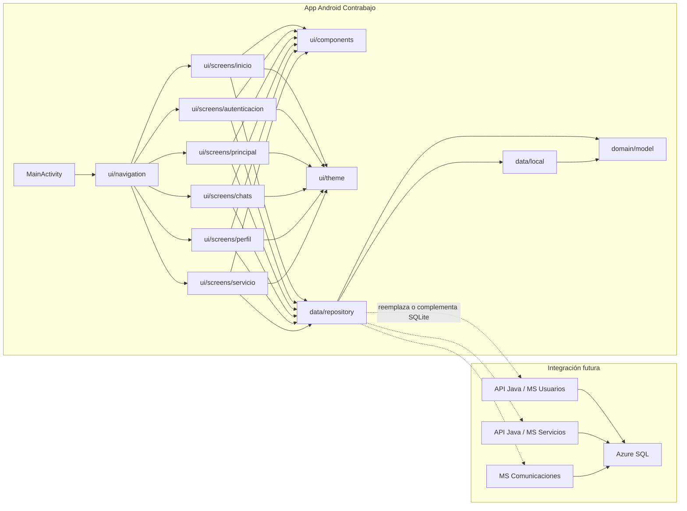

# Vista de Desarrollo

```mermaid
flowchart LR
    subgraph App["App Android Contrabajo"]
        A["MainActivity"]
        B["ui/navigation"]
        C["ui/screens/inicio"]
        D["ui/screens/autenticacion"]
        E["ui/screens/principal"]
        F["ui/screens/chats"]
        G["ui/screens/perfil"]
        H["ui/screens/servicio"]
        I["ui/components"]
        J["ui/theme"]
        K["domain/model"]
        L["data/repository"]
        M["data/local"]
    end

    A --> B
    B --> C
    B --> D
    B --> E
    B --> F
    B --> G
    B --> H
    C --> I
    D --> I
    E --> I
    F --> I
    G --> I
    H --> I
    C --> J
    D --> J
    E --> J
    F --> J
    G --> J
    H --> J
    C --> L
    D --> L
    E --> L
    F --> L
    G --> L
    H --> L
    L --> M
    L --> K
    M --> K

    subgraph Futuro["Integración futura"]
        N["API Java / MS Usuarios"]
        O["API Java / MS Servicios"]
        P["MS Comunicaciones"]
        Q["Azure SQL"]
    end

    L -. "reemplaza o complementa SQLite" .-> N
    L -.-> O
    L -.-> P
    N --> Q
    O --> Q
    P --> Q
```
