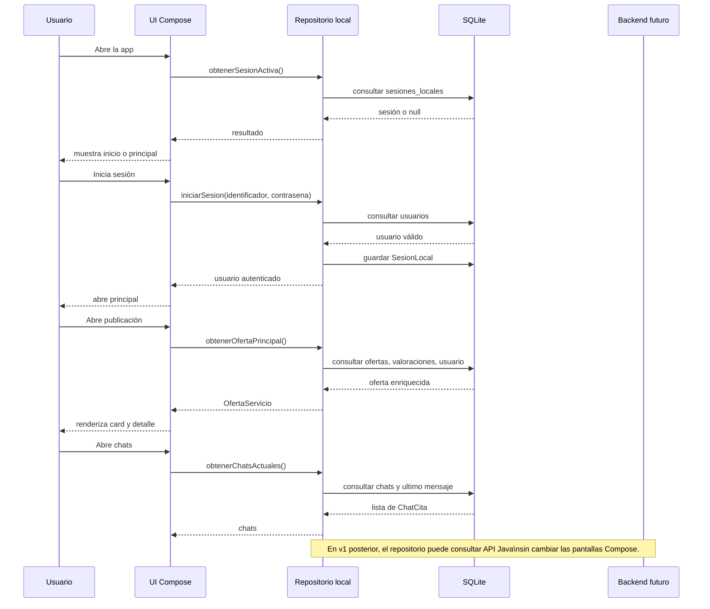

# Vista de Procesos

```mermaid
sequenceDiagram
    participant U as Usuario
    participant UI as UI Compose
    participant R as Repositorio local
    participant DB as SQLite
    participant API as Backend futuro

    U->>UI: Abre la app
    UI->>R: obtenerSesionActiva()
    R->>DB: consultar sesiones_locales
    DB-->>R: sesión o null
    R-->>UI: resultado
    UI-->>U: muestra inicio o principal

    U->>UI: Inicia sesión
    UI->>R: iniciarSesion(identificador, contrasena)
    R->>DB: consultar usuarios
    DB-->>R: usuario válido
    R->>DB: guardar SesionLocal
    R-->>UI: usuario autenticado
    UI-->>U: abre principal

    U->>UI: Abre publicación
    UI->>R: obtenerOfertaPrincipal()
    R->>DB: consultar ofertas, valoraciones, usuario
    DB-->>R: oferta enriquecida
    R-->>UI: OfertaServicio
    UI-->>U: renderiza card y detalle

    U->>UI: Abre chats
    UI->>R: obtenerChatsActuales()
    R->>DB: consultar chats y ultimo mensaje
    DB-->>R: lista de ChatCita
    R-->>UI: chats

    Note over R,API: En v1 posterior, el repositorio puede consultar API Java\nsin cambiar las pantallas Compose.
```
