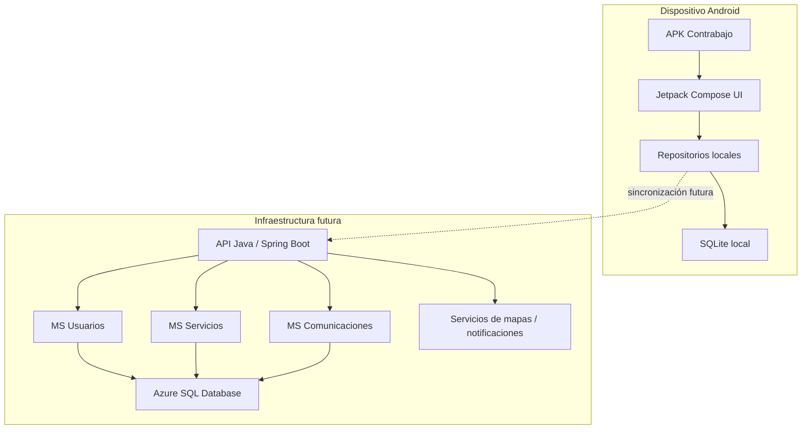

# Vista Física

```mermaid
flowchart TB
    subgraph Cliente["Dispositivo Android"]
        A["APK Contrabajo"]
        B["Jetpack Compose UI"]
        C["Repositorios locales"]
        D["SQLite local"]
    end

    subgraph Nube["Infraestructura futura"]
        E["API Java / Spring Boot"]
        F["MS Usuarios"]
        G["MS Servicios"]
        H["MS Comunicaciones"]
        I["Azure SQL Database"]
        J["Servicios de mapas / notificaciones"]
    end

    A --> B
    B --> C
    C --> D

    C -. "sincronización futura" .-> E
    E --> F
    E --> G
    E --> H
    F --> I
    G --> I
    H --> I
    E --> J
```
