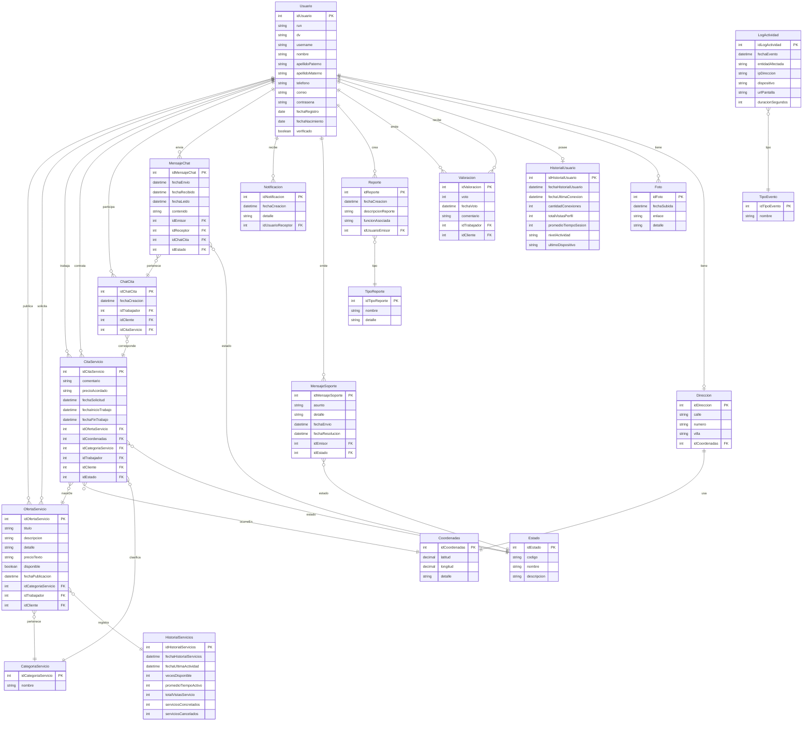
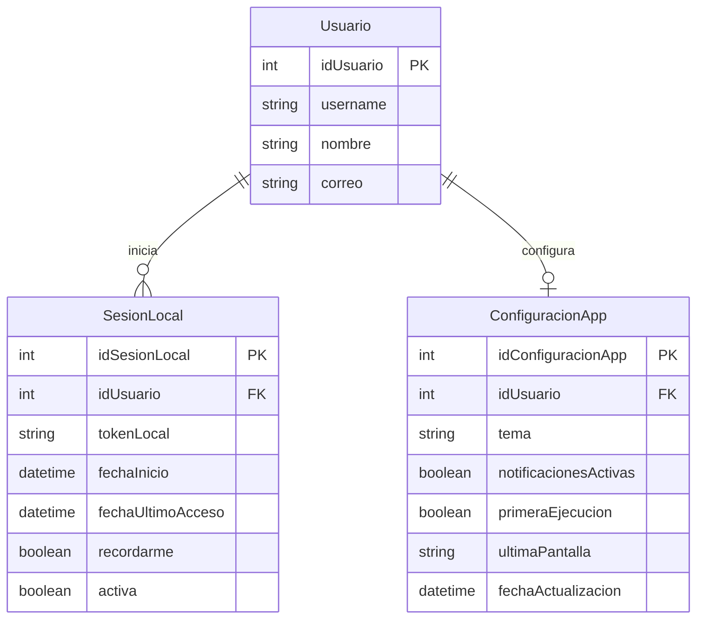
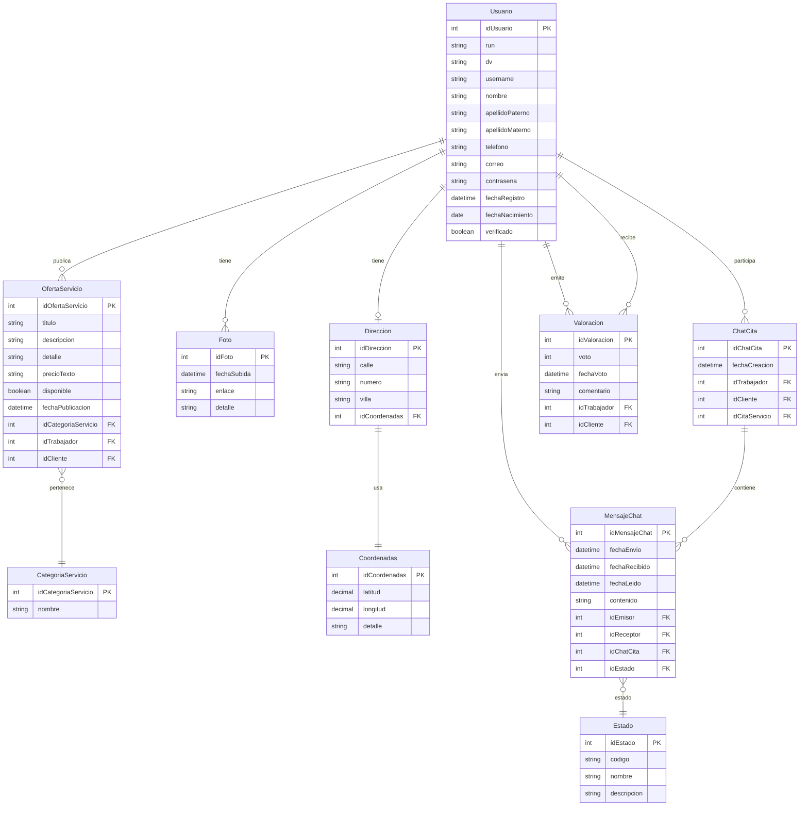

# Contrabajo MER

## Sistema completo

```mermaid
erDiagram
    Usuario {
        int idUsuario PK
        string run
        string dv
        string username
        string nombre
        string apellidoPaterno
        string apellidoMaterno
        string telefono
        string correo
        string contrasena
        date fechaRegistro
        date fechaNacimiento
        boolean verificado
    }
    Foto {
        int idFoto PK
        datetime fechaSubida
        string enlace
        string detalle
    }
    Direccion {
        int idDireccion PK
        string calle
        string numero
        string villa
        int idCoordenadas FK
    }
    Coordenadas {
        int idCoordenadas PK
        decimal latitud
        decimal longitud
        string detalle
    }
    CategoriaServicio {
        int idCategoriaServicio PK
        string nombre
    }
    Estado {
        int idEstado PK
        string codigo
        string nombre
        string descripcion
    }
    OfertaServicio {
        int idOfertaServicio PK
        string titulo
        string descripcion
        string detalle
        string precioTexto
        boolean disponible
        datetime fechaPublicacion
        int idCategoriaServicio FK
        int idTrabajador FK
        int idCliente FK
    }
    CitaServicio {
        int idCitaServicio PK
        string comentario
        string precioAcordado
        datetime fechaSolicitud
        datetime fechaInicioTrabajo
        datetime fechaFinTrabajo
        int idOfertaServicio FK
        int idCoordenadas FK
        int idCategoriaServicio FK
        int idTrabajador FK
        int idCliente FK
        int idEstado FK
    }
    ChatCita {
        int idChatCita PK
        datetime fechaCreacion
        int idTrabajador FK
        int idCliente FK
        int idCitaServicio FK
    }
    MensajeChat {
        int idMensajeChat PK
        datetime fechaEnvio
        datetime fechaRecibido
        datetime fechaLeido
        string contenido
        int idEmisor FK
        int idReceptor FK
        int idChatCita FK
        int idEstado FK
    }
    Notificacion {
        int idNotificacion PK
        datetime fechaCreacion
        string detalle
        int idUsuarioReceptor FK
    }
    MensajeSoporte {
        int idMensajeSoporte PK
        string asunto
        string detalle
        datetime fechaEnvio
        datetime fechaResolucion
        int idEmisor FK
        int idEstado FK
    }
    Reporte {
        int idReporte PK
        datetime fechaCreacion
        string descripcionReporte
        string funcionAsociada
        int idUsuarioEmisor FK
    }
    TipoReporte {
        int idTipoReporte PK
        string nombre
        string detalle
    }
    Valoracion {
        int idValoracion PK
        int voto
        datetime fechaVoto
        string comentario
        int idTrabajador FK
        int idCliente FK
    }
    HistorialServicios {
        int idHistorialServicios PK
        datetime fechaHistorialServicios
        datetime fechaUltimaActividad
        int vecesDisponible
        int promedioTiempoActivo
        int totalVistasServicio
        int serviciosConcretados
        int serviciosCancelados
    }
    HistorialUsuario {
        int idHistorialUsuario PK
        datetime fechaHistorialUsuario
        datetime fechaUltimaConexion
        int cantidadConexiones
        int totalVistasPerfil
        int promedioTiempoSesion
        string nivelActividad
        string ultimoDispositivo
    }
    LogActividad {
        int idLogActividad PK
        datetime fechaEvento
        string entidadAfectada
        string ipDireccion
        string dispositivo
        string urlPantalla
        int duracionSegundos
    }
    TipoEvento {
        int idTipoEvento PK
        string nombre
    }

    Usuario ||--o{ OfertaServicio : publica
    Usuario ||--o{ OfertaServicio : solicita
    Usuario ||--o{ CitaServicio : trabaja
    Usuario ||--o{ CitaServicio : contrata
    Usuario ||--o{ ChatCita : participa
    Usuario ||--o{ MensajeChat : envia
    Usuario ||--o{ Notificacion : recibe
    Usuario ||--o{ MensajeSoporte : emite
    Usuario ||--o{ Reporte : crea
    Usuario ||--o{ Valoracion : emite
    Usuario ||--o{ Valoracion : recibe
    Usuario ||--o| HistorialUsuario : posee
    Usuario ||--o{ Foto : tiene
    Usuario ||--o| Direccion : tiene

    Direccion ||--|| Coordenadas : usa
    OfertaServicio }o--|| CategoriaServicio : pertenece
    OfertaServicio }o--|| HistorialServicios : registra
    CitaServicio }o--|| OfertaServicio : naceDe
    CitaServicio }o--|| Coordenadas : ocurreEn
    CitaServicio }o--|| CategoriaServicio : clasifica
    CitaServicio }o--|| Estado : estado
    ChatCita }o--|| CitaServicio : corresponde
    MensajeChat }o--|| ChatCita : pertenece
    MensajeChat }o--|| Estado : estado
    MensajeSoporte }o--|| Estado : estado
    Reporte }o--|| TipoReporte : tipo
    LogActividad }o--|| TipoEvento : tipo
```

## Entidades nuevas locales

```mermaid
erDiagram
    Usuario {
        int idUsuario PK
        string username
        string nombre
        string correo
    }
    SesionLocal {
        int idSesionLocal PK
        int idUsuario FK
        string tokenLocal
        datetime fechaInicio
        datetime fechaUltimoAcceso
        boolean recordarme
        boolean activa
    }
    ConfiguracionApp {
        int idConfiguracionApp PK
        int idUsuario FK
        string tema
        boolean notificacionesActivas
        boolean primeraEjecucion
        string ultimaPantalla
        datetime fechaActualizacion
    }

    Usuario ||--o{ SesionLocal : inicia
    Usuario ||--o| ConfiguracionApp : configura
```

## Entidades imprescindibles del esquema original

```mermaid
erDiagram
    Usuario {
        int idUsuario PK
        string run
        string dv
        string username
        string nombre
        string apellidoPaterno
        string apellidoMaterno
        string telefono
        string correo
        string contrasena
        datetime fechaRegistro
        date fechaNacimiento
        boolean verificado
    }
    CategoriaServicio {
        int idCategoriaServicio PK
        string nombre
    }
    Estado {
        int idEstado PK
        string codigo
        string nombre
        string descripcion
    }
    Coordenadas {
        int idCoordenadas PK
        decimal latitud
        decimal longitud
        string detalle
    }
    Direccion {
        int idDireccion PK
        string calle
        string numero
        string villa
        int idCoordenadas FK
    }
    Foto {
        int idFoto PK
        datetime fechaSubida
        string enlace
        string detalle
    }
    OfertaServicio {
        int idOfertaServicio PK
        string titulo
        string descripcion
        string detalle
        string precioTexto
        boolean disponible
        datetime fechaPublicacion
        int idCategoriaServicio FK
        int idTrabajador FK
        int idCliente FK
    }
    ChatCita {
        int idChatCita PK
        datetime fechaCreacion
        int idTrabajador FK
        int idCliente FK
        int idCitaServicio FK
    }
    MensajeChat {
        int idMensajeChat PK
        datetime fechaEnvio
        datetime fechaRecibido
        datetime fechaLeido
        string contenido
        int idEmisor FK
        int idReceptor FK
        int idChatCita FK
        int idEstado FK
    }
    Valoracion {
        int idValoracion PK
        int voto
        datetime fechaVoto
        string comentario
        int idTrabajador FK
        int idCliente FK
    }

    Usuario ||--o{ OfertaServicio : publica
    Usuario ||--o{ ChatCita : participa
    Usuario ||--o{ MensajeChat : envia
    Usuario ||--o{ Valoracion : emite
    Usuario ||--o{ Valoracion : recibe
    Usuario ||--o{ Foto : tiene
    Usuario ||--o| Direccion : tiene
    Direccion ||--|| Coordenadas : usa
    OfertaServicio }o--|| CategoriaServicio : pertenece
    ChatCita ||--o{ MensajeChat : contiene
    MensajeChat }o--|| Estado : estado
```
